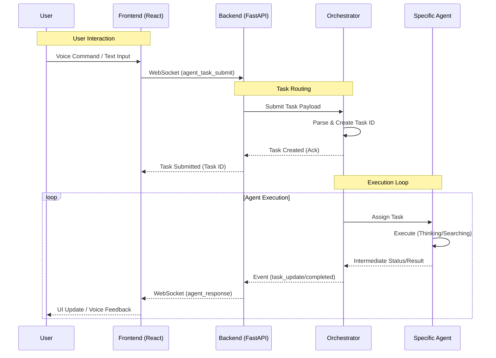

# JarvisAI

An advanced, agentic AI console application inspired by JARVIS. This system features a hybrid architecture combining a high-performance React/Electron frontend with a powerful Python FastAPI backend, capable of voice interaction, face recognition, and complex autonomous task execution through a multi-agent orchestration system.

## 🚀 Features

*   **Agentic Capabilities**: A central orchestrator managing specialized sub-agents (Web Search, Deep Search, Code Interpreter) to solve complex tasks.
*   **Real-time Voice Interaction**: Hotword detection ("Jarvis") using PocketSphinx and real-time transcription.
*   **Computer Vision**: Face recognition and verification using DeepFace.
*   **System Telemetry**: Real-time visualization of CPU, GPU, Memory, and Network usage.
*   **Modern UI**: Sci-fi inspired dashboard built with React, Tailwind CSS, and Radix UI.
*   **Cross-Platform**: Runs as a desktop application via Electron.

## 🏗️ System Architecture

The application follows a client-server architecture wrapped in Electron for desktop integration.

```mermaid
graph TD
    subgraph Client [Frontend (Electron/React)]
        E[Electron Main Process]
        R[React Renderer Process]
        
        subgraph UI [User Interface]
            Dashboard[Dashboard Components]
            Stores[Zustand State Stores]
            WS_Client[WebSocket Client]
        end
        
        E -->|Spawns| R
        R --> Dashboard
        Dashboard <--> Stores
        Stores <--> WS_Client
    end

    subgraph Server [Backend (Python/FastAPI)]
        P[Python Process]
        API[FastAPI App]
        CM[Connection Manager]
        
        subgraph Core_Services [Core Services]
            Hotword[Hotword Service]
            Face[Face Recognition]
            Settings[Settings Manager]
        end
        
        subgraph Agent_System [Agent System]
            Orch[Central Orchestrator]
            TaskMgr[Task Manager]
            SubAgents[Sub-Agents]
        end
        
        P --> API
        API <-->|WebSockets| CM
        CM <--> Core_Services
        CM <--> Agent_System
        Orch --> TaskMgr
        TaskMgr --> SubAgents
    end

    E -->|Spawns & Manages| P
    WS_Client <==>|ws://localhost:8000| API
```

## 🔄 Data Flow

The following diagram illustrates how a user request involves the detailed interaction between the frontend and the agentic backend.



## 🛠️ Tech Stack

### Frontend
*   **Core**: React 18, TypeScript, Vite
*   **Wrapper**: Electron
*   **Styling**: Tailwind CSS, Shadcn/UI, Framer Motion
*   **State Management**: Zustand
*   **Visualization**: Three.js (@react-three/fiber)
*   **Communication**: Native WebSockets

### Backend
*   **Core**: Python 3.8+, FastAPI
*   **Server**: Uvicorn
*   **AI/ML**:
    *   `PocketSphinx` (Hotword)
    *   `DeepFace` (Vision)
    *   `LangChain` / `AutoGen` (Agent concepts)
*   **System**: `psutil`, `pynvml` (NVIDIA GPU stats)

## 📂 Project Structure

```bash
JarvisAI/
├── electron.js             # Electron main process entry point
├── package.json            # Node dependencies and scripts
│
├── src/                    # Frontend Source
│   ├── components/         # Reusable React components
│   ├── pages/              # Main application views
│   ├── stores/             # Zustand state stores (transcription, video, etc.)
│   ├── lib/                # Utilities & WebSocket client
│   └── hooks/              # Custom React hooks
│
├── server/                 # Backend Source
│   ├── main.py             # FastAPI entry point & WebSocket routes
│   ├── agents/             # Agent implementations
│   │   ├── central_orchestrator.py  # Main agent coordinator
│   │   └── system_agent_wrapper.py  # System-level controls
│   ├── agent_integration.py # Bridges WebSockets with Agent Orchestrator
│   ├── connection_manager.py # Manages active WebSocket connections
│   └── settings.py         # App configuration management
│
└── requirements.txt        # Python dependencies
```

## ⚡ Setup & Installation

### Prerequisites
*   Node.js (v18+)
*   Python (v3.10+)
*   Visual Studio Build Tools (for C++ compilation required by some Python libs)

### 1. Frontend Setup
```bash
# Install Node dependencies
npm install
```

### 2. Backend Setup
```bash
# Navigate to server directory
cd server

# Create virtual environment
python -m venv venv
.\venv\Scripts\activate

# Install Python dependencies
pip install -r ../requirements.txt
```

## 🏃 Running the Application

### Development Mode (Concurrent)
Run both the frontend (Vite) and backend (Python) servers simultaneously:
```bash
npm run dev
```

### Manual Start
**Backend:**
```bash
cd server
python main.py
```
**Frontend:**
```bash
npm run frontend
```

## 🔌 API Endpoints (WebSockets)

*   `/communicate`: General command/settings channel.
*   `/hotword`: Streams audio for wake word detection.
*   `/face_recognition`: Streams video frames for face ID.
*   `/agents`: Submits tasks and receives agent updates.
*   `/info`: Streams system resources (CPU/RAM/GPU).
